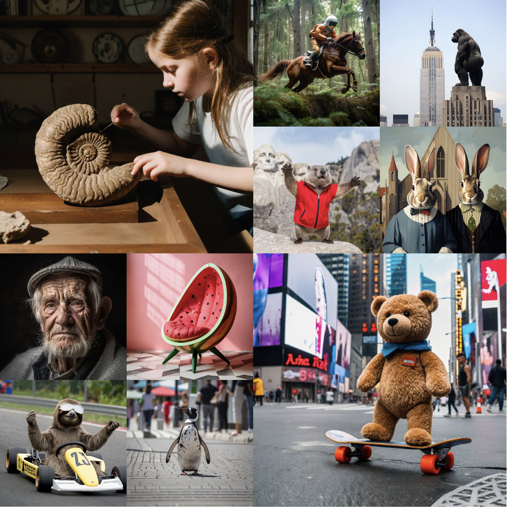

# Improved Distribution Matching Distillation for Fast Image Synthesis [[4-step demo](https://9c0c372395fcc6b0fe.gradio.live)][[1-step demo](https://bfd3dfa06e72e0d9f2.gradio.live)][[ComfyUI](https://gist.github.com/comfyanonymous/fcce4ced378f74f4c46026b134faf27a)]

Few-step Text-to-Image Generation.



> [**Improved Distribution Matching Distillation for Fast Image Synthesis**](https://tianweiy.github.io/dmd2/),            
> Tianwei Yin, Michaël Gharbi, Taesung Park, Richard Zhang, Eli Shechtman, Frédo Durand, William T. Freeman        
> *arXiv technical report ([arXiv 2405.14867](https://arxiv.org/abs/2405.14867))*  

## Contact 

Feel free to contact us if you have any questions about the paper!

Tianwei Yin [tianweiy@mit.edu](mailto:tianweiy@mit.edu)

## Abstract

Recent approaches have shown promises distilling diffusion models into
efficient one-step generators. Among them, Distribution Matching Distillation
(DMD) produces one-step generators that match their teacher in distribution,
without enforcing a one-to-one correspondence with the sampling trajectories of
their teachers. However, to ensure stable training, DMD requires an additional
regression loss computed using a large set of noise-image pairs generated by
the teacher with many steps of a deterministic sampler. This is costly for
large-scale text-to-image synthesis and limits the student's quality, tying it
too closely to the teacher's original sampling paths. We introduce DMD2, a set
of techniques that lift this limitation and improve DMD training. First, we
eliminate the regression loss and the need for expensive dataset construction.
We show that the resulting instability is due to the fake critic not estimating
the distribution of generated samples accurately and propose a two time-scale
update rule as a remedy. Second, we integrate a GAN loss into the distillation
procedure, discriminating between generated samples and real images. This lets
us train the student model on real data, mitigating the imperfect real score
estimation from the teacher model, and enhancing quality. Lastly, we modify the
training procedure to enable multi-step sampling. We identify and address the
training-inference input mismatch problem in this setting, by simulating
inference-time generator samples during training time. Taken together, our
improvements set new benchmarks in one-step image generation, with FID scores
of 1.28 on ImageNet-64x64 and 8.35 on zero-shot COCO 2014, surpassing the
original teacher despite a 500X reduction in inference cost. Further, we show
our approach can generate megapixel images by distilling SDXL, demonstrating
exceptional visual quality among few-step methods.

## Environment Setup

```.bash
# In conda env 
conda create -n dmd2 python=3.8 -y 
conda activate dmd2 

pip install --upgrade anyio
pip install torch==2.0.1  torchvision==0.15.2
pip install  --upgrade diffusers wandb lmdb transformers accelerate==0.23.0 lmdb datasets evaluate  scipy opencv-python matplotlib imageio piq==0.7.0 safetensors gradio
python setup.py  develop
```

## Inference Example

To reproduce our ImageNet results, run:

```.bash
python -m demo.imagenet_example  --checkpoint_path IMAGENET_CKPT_PATH 
```

To try our text-to-image generation demo, run:

```.bash
# Note: on the demo page, click ``Use Tiny VAE for faster decoding'' to enable much faster speed and lower memory consumption using a Tiny VAE from [madebyollin](https://huggingface.co/madebyollin/taesdxl)

# 4 step (much higher quality than 1 step)
python -m demo.text_to_image_sdxl --checkpoint_path SDXL_CKPT_PATH --precision float16

# 1 step 
python -m demo.text_to_image_sdxl --num_step 1 --checkpoint_path SDXL_CKPT_PATH --precision float16 --conditioning_timestep 399
```

Pretrained models can be found in [ImageNet](experiments/imagenet/README.md) and [SDXL](experiments/sdxl/README.md). 

## Training and Evaluation 

### ImageNet-64x64 

Please refer to [ImageNet-64x64](experiments/imagenet/README.md) for details.

### SDXL

Please refer to [SDXL](experiments/sdxl/README.md) for details.

### SDv1.5 

Please refer to [SDv1.5](experiments/sdv1.5/README.md) for details.

## License

Improved Distribution Matching Distillation is released under [Creative Commons Attribution-NonCommercial-ShareAlike 4.0 International License](LICENSE.md).

## Known Issues 

- [ ] Current FSDP for SDXL training is really slow; help is greatly appreciated!

## Citation 

If you find DMD2 useful or relevant to your research, please kindly cite our papers:

```bib
@article{yin2024improved,
    title={Improved Distribution Matching Distillation for Fast Image Synthesis},
    author={Yin, Tianwei and Gharbi, Micha{\"e}l and Park, Taesung and Zhang, Richard and Shechtman, Eli and Durand, Fredo and Freeman, William T},
    journal={arXiv 2405.14867},
    year={2024}
}

@inproceedings{yin2024onestep,
    title={One-step Diffusion with Distribution Matching Distillation},
    author={Yin, Tianwei and Gharbi, Micha{\"e}l and Zhang, Richard and Shechtman, Eli and Durand, Fr{\'e}do and Freeman, William T and Park, Taesung},
    booktitle={CVPR},
    year={2024}
}
```

## Third-part Code

[EDM](https://github.com/NVlabs/edm/tree/main) for [dnnlib](dnnlib), [torch_utils](torch_utils) and [edm](third_party/edm) folders.

## Acknowledgments 

This work was done while Tianwei Yin was a full-time student at MIT. It was developed based on our reimplementation of the original DMD paper. This work was supported by the National Science Foundation under Cooperative Agreement PHY-2019786 (The NSF AI Institute for Artificial Intelligence and Fundamental Interactions, http://iaifi.org/), by NSF Grant 2105819, by NSF CISE award 1955864, and by funding from Google, GIST, Amazon, and Quanta Computer.

